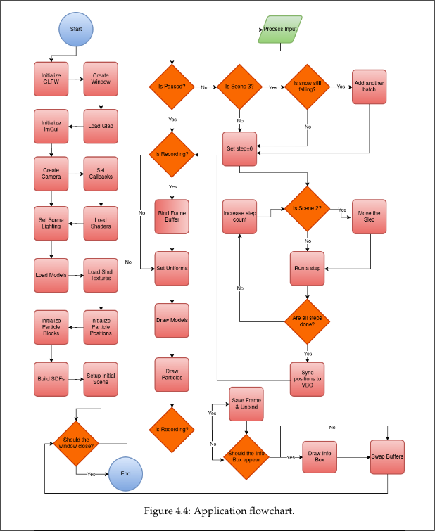
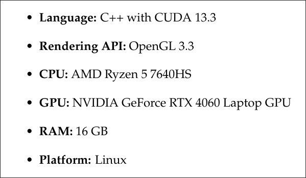
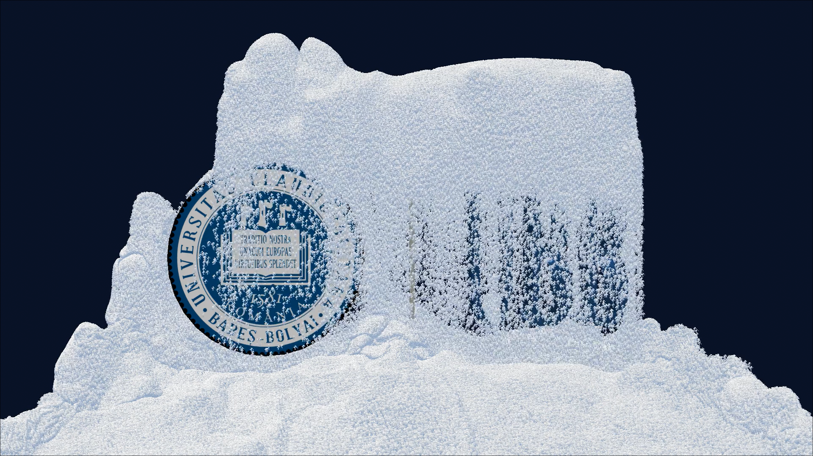
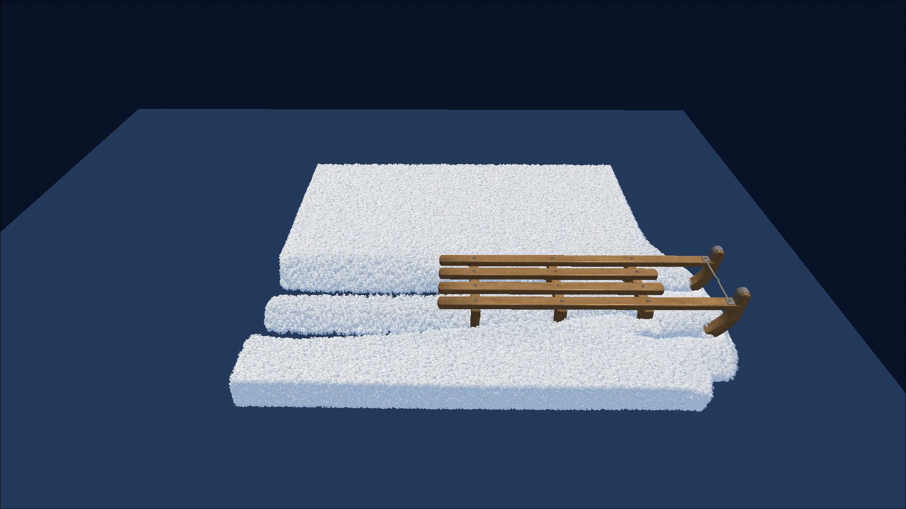
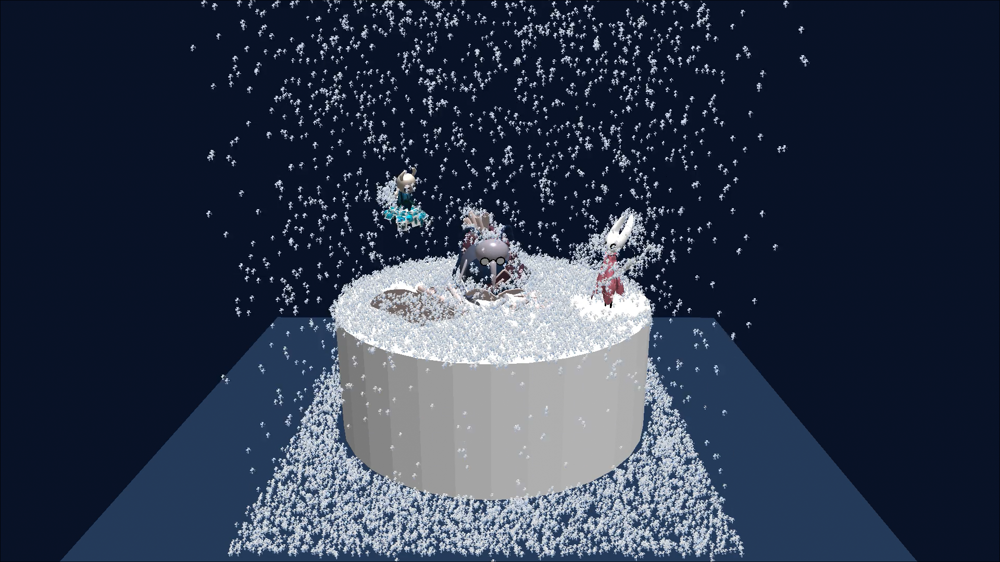
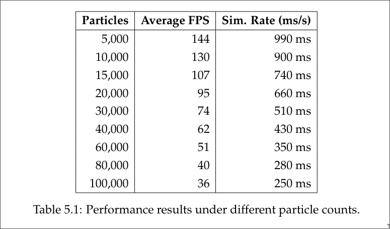

# Snow Simulation (MLS-MPM)

An implementation of the Moving Least Squares Material Point Method (MLS-MPM) for snow simulation using CUDA and OpenGL.

## Dependencies

### Arch Linux

```bash
sudo pacman -S cuda glfw glm assimp
```

## Application Overview



## System Specifications


## Results (Offline Simulation)

### Stiff Snowfall



*UBB Logo created using Blender.*

### Soft Snow Tracks



*Sled model from [Sketchfab](https://sketchfab.com/3d-models/low-poly-winter-sled-6f521686830b42728a1b9bf300a2e62a).*

### Snowfall



*Assets from Sketchfab: [Hollow Knight](https://sketchfab.com/3d-models/hollow-knight-fanart-aee54b0967114f4699ba25a77d467eac), [Cornifer](https://sketchfab.com/3d-models/hollow-knight-npc-cornifer-5c45243d2f5340c18cc0897b92623ec0), [Hornet](https://sketchfab.com/3d-models/hornet-hollow-knight-05fe017749ea484d8325afafce620c60).*

## Results (Real-Time Simulation)



## References

* **[SSC+13]** Alexey Stomakhin, Craig Schroeder, Lawrence Chai, Joseph Teran, and Andrew Selle. *A material point method for snow simulation.* ACM Transactions on Graphics (TOG), 32(4):1–10, 2013.
* **[HFG+18]** Yuanming Hu, Yu Fang, Ziheng Ge, Ziyin Qu, Yixin Zhu, Andre Pradhana, and Chenfanfu Jiang. *A moving least squares material point method with displacement discontinuity and two-way rigid body coupling.* ACM Transactions on Graphics (TOG), 37(4):1–14, 2018.
* **[FHG21]** Yun Fei, Yuhan Huang, and Ming Gao. *Principles towards real-time simulation of material point method on modern gpus.* arXiv preprint arXiv:2111.00699, 2021.